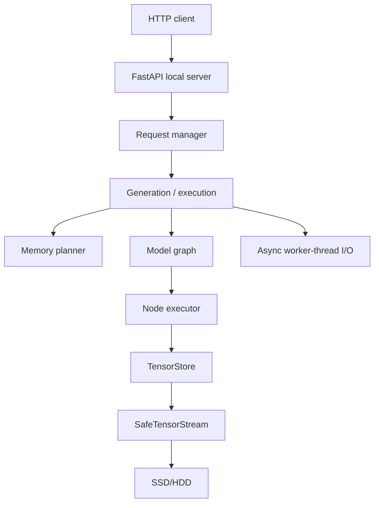

# Architecture Overview

```mermaid
flowchart TD
 C[HTTP client]-->S[FastAPI local server]-->Q[Request manager]
 Q-->E[Generation / execution]
 E-->P[Memory planner]
 E-->G[Model graph]
 G-->X[Node executor]
 X-->T[TensorStore]
 T-->F[SafeTensorStream]
 F-->D[SSD/HDD]
 E-->A[Async worker-thread I/O]
```

The HTTP layer does not parse safetensors offsets. Storage does not know HTTP. The scheduler abstractions are independent of FastAPI.
